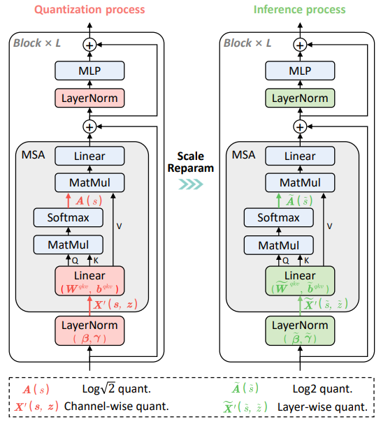
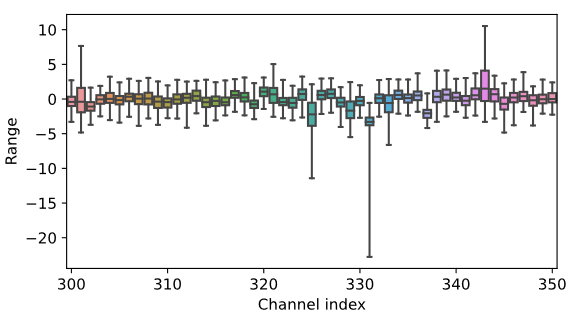
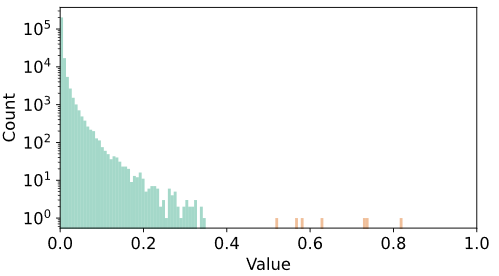

<div align=center>
  
  </div>

## RepQ-ViT: Scale Reparameterization for Post-Training Quantization of Vision Transformers

This repository contains the official PyTorch implementation for the paper
*["RepQ-ViT: Scale Reparameterization for Post-Training Quantization of Vision Transformers"](https://arxiv.org/abs/2212.08254).* RepQ-ViT **decouples** the quantization and inference processes and applies **scale reparameterization** to solve the extreme distribution issues in vision transformers, including post-LayerNorm and post-Softmax activations as follows:

- *Post-LayerNorm activations with severe inter-channel variation:*
  
  <div align=center>
  
  </div>

- *Post-Softmax activations with power-law features:*
  
  <div align=center>
  
  </div>

## Installation

- **To install RepQ-ViT** and develop locally:
  
  ```bash
  git clone https://github.com/zkkli/RepQ-ViT.git
  cd RepQ-ViT
  ```

## Quantization

Please see [**classification readme**](https://github.com/zkkli/RepQ-ViT/tree/main/classification) for instructions to reproduce classification results on ImageNet and see [**detection readme**](https://github.com/zkkli/RepQ-ViT/tree/main/detection) for instructions to reproduce detection results on COCO.

## Citation

We appreciate it if you would please cite the following paper if you found the implementation useful for your work:

```bash
@article{li2022repqvit,
  title={RepQ-ViT: Scale Reparameterization for Post-Training Quantization of Vision Transformers},
  author={Li, Zhikai and Xiao, Junrui and Yang, Lianwei and Gu, Qingyi},
  journal={arXiv preprint arXiv:2212.08254},
  year={2022}
}
```
